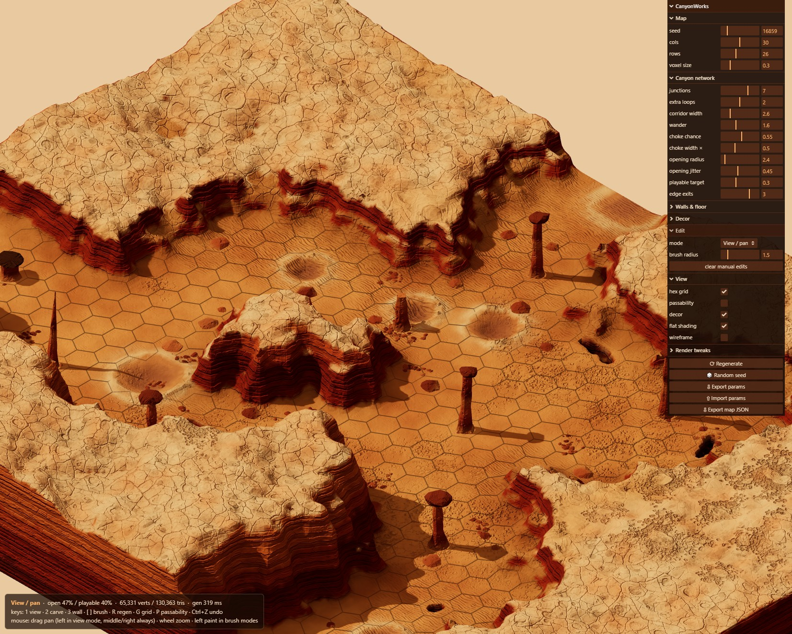

# CanyonWorks

Canyon-map sandbox — generator / visualizer / editor — for the **Nether-Mars**
tactical hex game. Stylized Sedona-look Martian canyons, fully parametric,
brush-editable, hex-aligned.

**▶ Live showcase: https://sigman78.github.io/canyonworks/**



Gameplay topology comes first: passability is decided per hex *before*
meshing and the terrain is forced to agree. On top of that: multi-level
domed mesas with drainage, craters, hex-aligned fissures, four pillar
archetypes, GenAI detail textures with tri-planar bump/sheen, baked AO,
a tweakable sun, and a decorative sandstorm fog-of-war.

```sh
npm install
npm run dev      # http://localhost:5173
npm run check    # typecheck
npm run build
```

- Docs: [docs/DESIGN.md](docs/DESIGN.md) · [docs/TASKS.md](docs/TASKS.md) ·
  [docs/WORKLOG.md](docs/WORKLOG.md)
- Controls: `1/2/3` view/carve/wall · `[ ]` brush size · drag to pan
  (left in view mode; middle/right always) · wheel zoom · `R` regen ·
  `G` grid · `P` passability · `Ctrl+Z` undo
- Textures: regenerate with `node tools/gen-textures.mjs [name]` (needs
  a nano-banana2 key in `.env.local` as `VITE_NANOBANANA_KEY`; the
  generated JPGs are committed, so this is only needed for new ones)

Deployed to GitHub Pages by [CI](.github/workflows/deploy.yml) on every
push to `main`.
